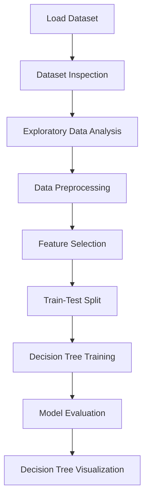
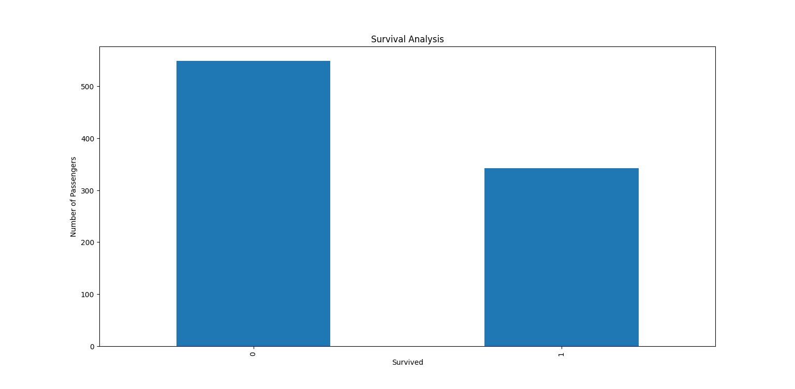
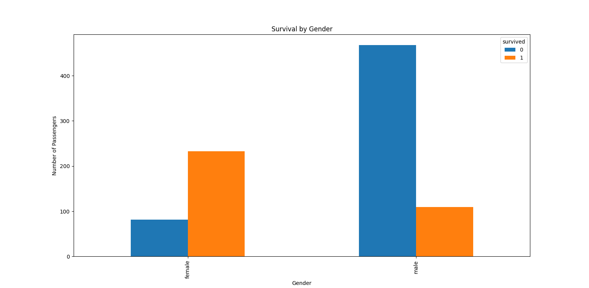
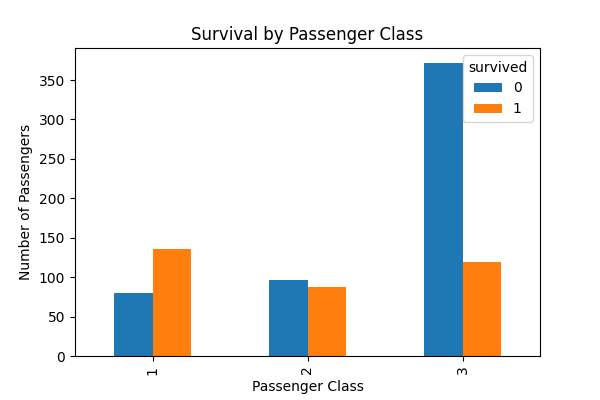
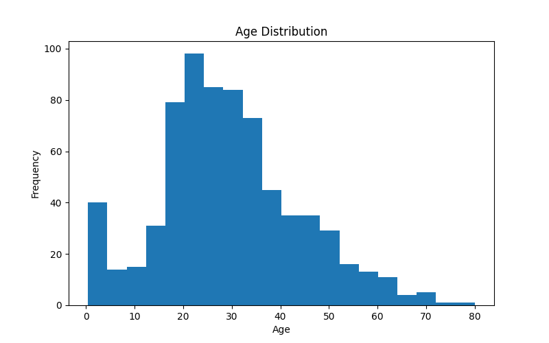
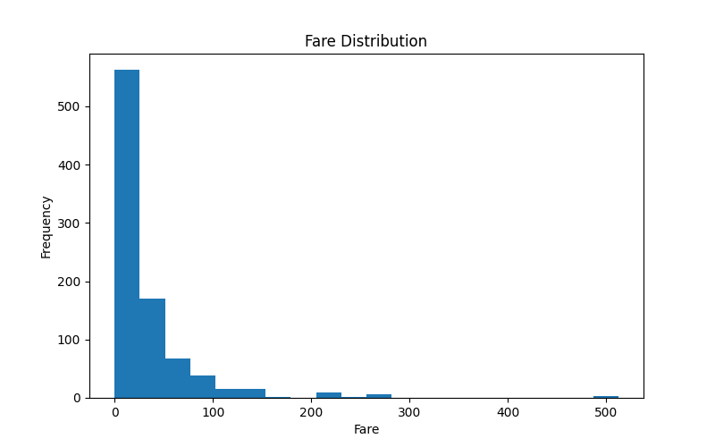
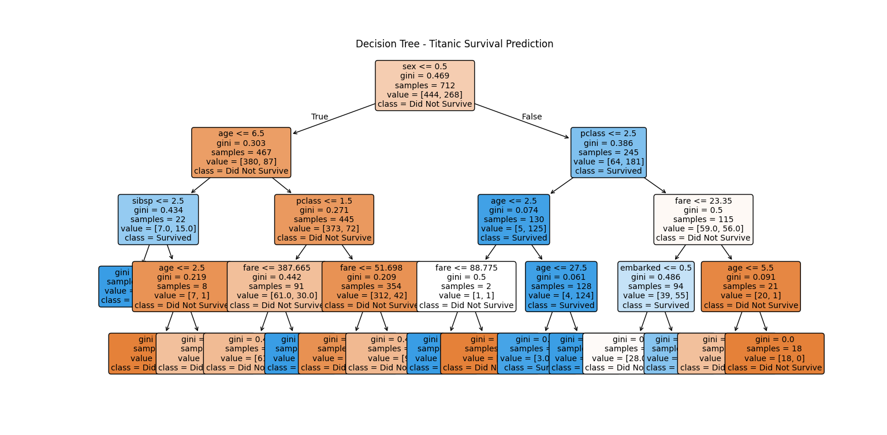

# 🚢 Titanic Survival Prediction using Decision Tree Classifier

<p align="center">


</p>

<p align="center">
An end-to-end Machine Learning project that predicts passenger survival on the RMS Titanic using a Decision Tree Classifier. The project demonstrates the complete ML workflow—from understanding raw data to building, evaluating, and interpreting a predictive model.
</p>

---

# 📌 Project Highlights

* ✅ Real-world Machine Learning Dataset
* ✅ Complete Exploratory Data Analysis (EDA)
* ✅ Data Cleaning & Preprocessing
* ✅ Missing Value Handling
* ✅ Label Encoding
* ✅ Decision Tree Classification
* ✅ Confusion Matrix & Classification Report
* ✅ Decision Tree Visualization
* ✅ Modular Project Structure

---

# 📊 Quick Stats

| Metric            |                    Value |
| ----------------- | -----------------------: |
| Dataset           | Titanic Survival Dataset |
| Total Records     |                      891 |
| Original Features |              10 + Target |
| Features Used     |                        7 |
| Algorithm         | Decision Tree Classifier |
| Criterion         |               Gini Index |
| Max Depth         |                        4 |
| Train-Test Split  |                  80 : 20 |
| Test Accuracy     |               **79.89%** |

---

# 🎯 Problem Statement

The sinking of the RMS Titanic remains one of history's most well-known maritime disasters. Given information about a passenger such as age, gender, passenger class, fare, and family details, can a Machine Learning model predict whether that passenger survived?

This project formulates the problem as a **Binary Classification** task.

| Target | Meaning         |
| ------ | --------------- |
| **0**  | Did Not Survive |
| **1**  | Survived        |

---

# 📂 Dataset Overview

The project uses the **Titanic Survival Dataset**, one of the most popular introductory datasets for supervised learning.

| Property        | Value                    |
| --------------- | ------------------------ |
| Dataset         | Titanic Survival Dataset |
| Records         | 891                      |
| Problem Type    | Binary Classification    |
| Target Variable | `survived`               |

### Original Features

| Feature  | Description                |
| -------- | -------------------------- |
| pclass   | Passenger Class            |
| name     | Passenger Name             |
| sex      | Gender                     |
| age      | Passenger Age              |
| sibsp    | Number of Siblings/Spouses |
| parch    | Number of Parents/Children |
| ticket   | Ticket Number              |
| fare     | Ticket Fare                |
| cabin    | Cabin Number               |
| embarked | Port of Embarkation        |

---

# 🔄 Machine Learning Workflow



---

# 📸 Exploratory Data Analysis

Before training the model, the dataset was explored to understand hidden patterns.

---

## 📈 Survival Distribution

<p align="center">

</p>

### Observation

* More passengers **did not survive** than survived.
* The dataset is slightly imbalanced but suitable for classification.

---

## 👨 Gender vs Survival

<p align="center">

</p>

### Observation

Female passengers had a significantly higher survival rate than male passengers.

This later became the **root decision** in the trained Decision Tree.

---

## 🎩 Passenger Class vs Survival

<p align="center">

</p>

### Observation

Passengers travelling in **First Class** survived considerably more often than passengers travelling in Third Class.

---

## 👶 Age Distribution

<p align="center">

</p>

### Observation

Most passengers were between **20–40 years old**.

---

## 💰 Fare Distribution

<p align="center">

</p>

### Observation

Ticket fares were highly skewed, with a few passengers paying significantly higher fares.

---

# 🧹 Data Preprocessing

The dataset required several preprocessing steps before it could be used for training.

| Step             | Action                    | Reason                                       |
| ---------------- | ------------------------- | -------------------------------------------- |
| Drop Columns     | `name`, `ticket`, `cabin` | Irrelevant or high missing values            |
| Missing Age      | Filled using Median       | Median is robust against outliers            |
| Missing Embarked | Filled using Mode         | Only two missing values                      |
| Encode Sex       | Male → 0, Female → 1      | Convert categorical data into numerical form |
| Encode Embarked  | S → 0, C → 1, Q → 2       | Numerical representation for ML model        |

---

# 🌳 Decision Tree Configuration

The model was trained using Scikit-Learn's `DecisionTreeClassifier`.

```python
DecisionTreeClassifier(
    criterion="gini",
    max_depth=4,
    random_state=42
)
```

### Why these parameters?

| Parameter        | Reason                                                    |
| ---------------- | --------------------------------------------------------- |
| criterion="gini" | Uses Gini Impurity for selecting the best split           |
| max_depth=4      | Prevents overfitting while keeping the tree interpretable |
| random_state=42  | Ensures reproducible results                              |

---

# 📈 Model Performance

## Overall Accuracy

| Metric   | Score      |
| -------- | ---------- |
| Accuracy | **79.89%** |

---

## Confusion Matrix

| Actual / Predicted  | Did Not Survive | Survived |
| ------------------- | --------------: | -------: |
| **Did Not Survive** |              96 |        9 |
| **Survived**        |              27 |       47 |

### Interpretation

* The model correctly classified **96 passengers** who did not survive.
* It correctly identified **47 passengers** who survived.
* Most prediction errors came from passengers who survived but were predicted as non-survivors.

---

## Classification Report

| Class           | Precision | Recall | F1-Score |
| --------------- | --------: | -----: | -------: |
| Did Not Survive |      0.78 |   0.91 |     0.84 |
| Survived        |      0.84 |   0.64 |     0.72 |

---

# 🌳 Decision Tree Visualization

<p align="center">

</p>

The trained Decision Tree provides an interpretable view of the model's decision-making process.

Instead of functioning as a "black box," every prediction can be traced through a sequence of logical decisions based on passenger features.

---

# 🧠 Model Insights

One of the most interesting outcomes of this project is that the Decision Tree independently learned the same patterns observed during Exploratory Data Analysis.

### Key Insights

* **Sex became the root node**, indicating it was the most influential feature.
* **Passenger Class** appeared multiple times throughout the tree.
* **Fare** was an important feature for separating passengers.
* **Age** helped distinguish survival among younger passengers.
* The model naturally discovered historical survival trends without any manual rules.

---

# 📚 Learning Outcomes

Through this project, I learned:

* Working with real-world datasets
* Exploratory Data Analysis (EDA)
* Handling missing values
* Median & Mode Imputation
* Label Encoding
* Feature Selection
* Decision Tree Classification
* Gini Index
* Train-Test Splitting
* Confusion Matrix
* Precision
* Recall
* F1 Score
* Decision Tree Interpretation

---

# 📁 Project Structure

```text
Titanic-Survival-Prediction-Decision-Tree-MLP3/

├── data/
│   └── train.csv
│
├── notebooks/
│   └── eda.py
│
├── src/
│   ├── preprocessing.py
│   ├── train.py
│   ├── evaluate.py
│   └── visualize.py
│
├── outputs/
│   ├── Figure_1.png
│   ├── Figure_2.png
│   ├── Figure_3.png
│   ├── Figure_4.png
│   ├── Figure_5.png
│   └── Figure_6.png
│
├── main.py
├── requirements.txt
└── README.md
```

---

# ⚙️ Installation

```bash
git clone https://github.com/devangshupandey2025-stack/Titanic-Survival-Prediction-Decision-Tree-MLP3.git

cd Titanic-Survival-Prediction-Decision-Tree-MLP3

python -m venv venv

# Windows
venv\Scripts\activate

# macOS / Linux
source venv/bin/activate

pip install -r requirements.txt
```

---

# ▶️ Running the Project

Run the complete pipeline:

```bash
python main.py
```

This performs:

* Dataset Loading
* Data Preprocessing
* Decision Tree Training
* Model Evaluation
* Decision Tree Visualization

Run only the Exploratory Data Analysis:

```bash
python notebooks/eda.py
```

---

# 🚀 Future Improvements

* [ ] Feature Importance Visualization
* [ ] Hyperparameter Tuning using GridSearchCV
* [ ] Random Forest Implementation
* [ ] Logistic Regression Comparison
* [ ] ROC Curve & AUC Score
* [ ] Cross Validation
* [ ] Model Deployment using Flask/FastAPI

---

# 👨‍💻 Author

**Devangshu Pandey**

* GitHub: https://github.com/devangshupandey2025-stack

---

# ⭐ Conclusion

This project demonstrates the complete lifecycle of a supervised machine learning workflow—from understanding a raw dataset to building, evaluating, and interpreting a predictive model.

Rather than focusing solely on achieving high accuracy, the project emphasizes clean preprocessing, model interpretability, and modular code organization. It serves as a strong foundation for future ensemble learning techniques such as Random Forests and Gradient Boosting.

---

<p align="center">

⭐ If you found this project useful, consider giving it a star!

</p>
